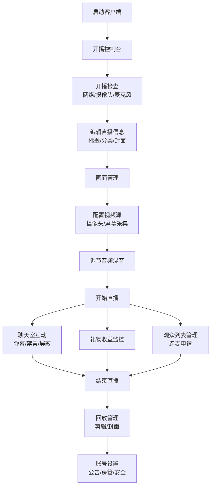

## 1. 产品概述

直播平台桌面客户端是一款面向主播和房管的专业直播工具，集成开播控制台、画面管理、聊天室、礼物收益、观众列表、回放管理、账号设置七大功能模块，让主播在一个窗口内完成开播、互动和复盘全流程。

- **目标用户**：主播、房间管理员
- **核心价值**：一站式直播管理，提升开播效率与互动体验

## 2. 核心功能

### 2.1 用户角色

| 角色 | 核心权限 |
|------|----------|
| 主播 | 全部功能权限，开播控制、画面管理、收益查看、回放管理、账号设置 |
| 房管 | 聊天室管理、观众禁言、关键词屏蔽、公告编辑 |

### 2.2 功能模块

1. **开播控制台**：开播检查、标题分类编辑、直播时长统计、开播/下播控制
2. **画面管理**：摄像头预览、屏幕采集选择、音量混音、场景切换
3. **聊天室**：弹幕管理、关键词屏蔽、观众禁言、礼物播报
4. **礼物收益**：收益明细、礼物统计、收益趋势
5. **观众列表**：在线观众、连麦申请、观众信息
6. **回放管理**：回放列表、回放剪辑、封面更换
7. **账号设置**：公告编辑、房管权限、异常提醒

### 2.3 页面详情

| 窗口名称 | 模块名称 | 功能描述 |
|----------|----------|----------|
| 开播控制台 | 开播检查 | 网络状态、摄像头、麦克风、推流地址检测 |
| 开播控制台 | 直播信息 | 标题编辑、分类选择、封面设置 |
| 开播控制台 | 开播控制 | 开始直播、暂停直播、结束直播、直播时长计时 |
| 画面管理 | 视频源管理 | 摄像头预览、屏幕采集选择、画面参数调节 |
| 画面管理 | 场景管理 | 场景列表、场景切换、场景编辑 |
| 画面管理 | 音频混音 | 麦克风音量、系统音量、混音调节、静音控制 |
| 聊天室 | 弹幕展示 | 实时弹幕滚动、弹幕样式、礼物弹幕 |
| 聊天室 | 弹幕管理 | 关键词屏蔽、弹幕速度、弹幕透明度 |
| 聊天室 | 观众管理 | 禁言/解禁、踢人、房管设置 |
| 礼物收益 | 礼物播报 | 礼物动画、礼物名称、送礼人信息 |
| 礼物收益 | 收益统计 | 今日收益、累计收益、礼物排行 |
| 礼物收益 | 收益明细 | 礼物列表、时间筛选、导出功能 |
| 观众列表 | 在线观众 | 观众列表、入场提示、观众等级 |
| 观众列表 | 连麦申请 | 申请列表、接受/拒绝、连麦控制 |
| 回放管理 | 回放列表 | 历史回放、回放时长、回放状态 |
| 回放管理 | 回放编辑 | 视频剪辑、封面更换、标题编辑 |
| 账号设置 | 个人信息 | 头像、昵称、简介编辑 |
| 账号设置 | 房管管理 | 房管列表、添加/移除房管 |
| 账号设置 | 安全设置 | 异常提醒、登录记录、安全选项 |

## 3. 核心流程

主播从打开客户端到完成直播的完整流程：启动客户端 → 进入开播控制台 → 执行开播检查 → 编辑直播标题与分类 → 切换到画面管理 → 配置摄像头和屏幕采集 → 调整音频混音 → 返回控制台开始直播 → 实时查看聊天室互动 → 监控礼物收益 → 管理观众与连麦 → 结束直播 → 查看回放 → 设置账号信息。

## 4. 用户界面设计

### 4.1 设计风格

- **设计主题**：深色科技风，专业直播控制台
- **主色调**：深空蓝 (#0F172A) 作为主背景，霓虹紫 (#8B5CF6) 作为强调色
- **辅助色**：青色 (#06B6D4) 用于交互元素，玫瑰红 (#F43F5E) 用于警示/直播状态
- **字体**：标题使用 Orbitron 科技感字体，正文使用 Inter 清晰易读
- **卡片风格**：半透明玻璃拟态 + 霓虹边框光晕
- **按钮风格**：渐变填充 + 发光悬停效果
- **图标风格**：线性图标 + 霓虹发光效果

### 4.2 页面设计概述

| 窗口名称 | 模块名称 | UI 元素 |
|----------|----------|---------|
| 主界面 | 侧边导航 | 图标 + 文字导航，七个功能窗口切换 |
| 主界面 | 内容区 | 卡片式布局，模块分区展示 |
| 开播控制台 | 状态面板 | 检查项列表，绿色对勾/红色叉号状态指示 |
| 开播控制台 | 直播控制 | 大型开播按钮，直播计时数字显示 |
| 画面管理 | 预览区 | 大尺寸视频预览框，画面源切换标签 |
| 画面管理 | 控制面板 | 滑块调节，音量波形可视化 |
| 聊天室 | 消息区 | 气泡式弹幕，滚动动画，礼物特效 |
| 聊天室 | 输入区 | 输入框 + 快捷操作按钮 |
| 礼物收益 | 数据概览 | 大数字卡片，收益趋势图表 |
| 礼物收益 | 明细列表 | 表格展示，时间筛选器 |
| 观众列表 | 观众卡片 | 头像 + 昵称 + 等级标签 |
| 观众列表 | 连麦申请 | 申请卡片，接受/拒绝按钮 |
| 回放管理 | 回放网格 | 视频卡片网格，封面缩略图 |
| 回放管理 | 编辑器 | 时间轴剪辑，封面上传 |
| 账号设置 | 设置表单 | 分组设置项，开关控件，输入框 |

### 4.3 响应式

- 桌面端优先设计，最小支持 1280px 宽度
- 侧边导航固定宽度，内容区自适应
- 窗口支持拖拽和独立分离（模拟多窗口体验）

### 4.4 动效设计

- 开播按钮脉冲呼吸动画
- 弹幕滑入滑出动画
- 礼物掉落特效动画
- 页面切换淡入淡出过渡
- 数字增长滚动动画
- 音量波形实时跳动效果
