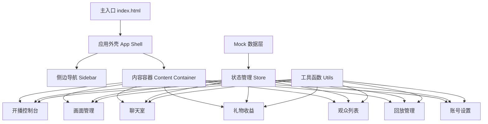

## 1. 架构设计

直播平台桌面客户端采用单页应用 (SPA) 架构，通过标签页/面板切换模拟多窗口体验。前端使用原生 HTML/CSS/JavaScript 实现，无需后端依赖，所有数据使用本地 Mock 数据模拟。



## 2. 技术描述

- **前端技术**：原生 HTML5 + CSS3 + JavaScript (ES6+)
- **构建工具**：无需构建，直接在浏览器运行
- **样式方案**：CSS 变量 + BEM 命名规范 + CSS Grid/Flexbox
- **状态管理**：简易发布订阅模式 (EventEmitter)
- **图表可视化**：原生 Canvas 绘制图表
- **图标方案**：内联 SVG 图标
- **数据层**：本地 Mock 数据 + localStorage 持久化
- **字体**：Google Fonts (Orbitron + Inter)

## 3. 目录结构

```
/
├── index.html              # 主入口文件
├── css/
│   ├── style.css           # 全局样式与变量
│   ├── console.css         # 开播控制台样式
│   ├── scene.css           # 画面管理样式
│   ├── chat.css            # 聊天室样式
│   ├── gift.css            # 礼物收益样式
│   ├── audience.css        # 观众列表示意图
│   ├── replay.css          # 回放管理样式
│   └── settings.css        # 账号设置样式
├── js/
│   ├── app.js              # 应用主逻辑
│   ├── store.js            # 状态管理
│   ├── mock/
│   │   └── data.js         # Mock 数据
│   ├── utils/
│   │   ├── common.js       # 通用工具函数
│   │   └── chart.js        # 图表绘制工具
│   └── modules/
│       ├── console.js      # 开播控制台模块
│       ├── scene.js        # 画面管理模块
│       ├── chat.js         # 聊天室模块
│       ├── gift.js         # 礼物收益模块
│       ├── audience.js     # 观众列表模块
│       ├── replay.js       # 回放管理模块
│       └── settings.js     # 账号设置模块
└── assets/
    └── icons/              # SVG 图标资源
```

## 4. 模块定义

### 4.1 核心模块

| 模块名 | 文件名 | 功能描述 |
|--------|--------|----------|
| 应用主逻辑 | app.js | 路由切换、事件绑定、初始化 |
| 状态管理 | store.js | 全局状态、事件订阅发布 |
| 开播控制台 | console.js | 开播检查、直播控制、计时 |
| 画面管理 | scene.js | 视频源、场景、音频控制 |
| 聊天室 | chat.js | 弹幕、屏蔽、禁言管理 |
| 礼物收益 | gift.js | 收益统计、礼物明细 |
| 观众列表 | audience.js | 观众管理、连麦申请 |
| 回放管理 | replay.js | 回放列表、剪辑、封面 |
| 账号设置 | settings.js | 公告、房管、安全设置 |

## 5. 数据模型

### 5.1 直播状态

```javascript
{
  isLive: boolean,        // 是否开播
  title: string,          // 直播标题
  category: string,       // 分类
  cover: string,          // 封面
  startTime: number,      // 开始时间戳
  duration: number,       // 直播时长(秒)
  viewerCount: number,    // 观看人数
  likeCount: number,      // 点赞数
}
```

### 5.2 弹幕消息

```javascript
{
  id: string,
  userId: string,
  userName: string,
  userLevel: number,
  content: string,
  type: 'normal' | 'gift' | 'system',
  timestamp: number,
  giftInfo?: {
    name: string,
    count: number,
    value: number,
  }
}
```

### 5.3 观众信息

```javascript
{
  id: string,
  name: string,
  avatar: string,
  level: number,
  isVip: boolean,
  isMuted: boolean,
  isAdmin: boolean,
  joinTime: number,
}
```

### 5.4 礼物收益

```javascript
{
  todayIncome: number,
  totalIncome: number,
  giftList: Array<{
    id: string,
    name: string,
    icon: string,
    value: number,
    count: number,
    sender: string,
    time: number,
  }>,
}
```

### 5.5 回放视频

```javascript
{
  id: string,
  title: string,
  cover: string,
  duration: number,
  startTime: number,
  views: number,
  likes: number,
  status: 'published' | 'processing' | 'draft',
}
```

## 6. 状态管理

采用简易发布订阅模式实现全局状态管理：

- `store.getState()` - 获取当前状态
- `store.setState(newState)` - 更新状态
- `store.subscribe(callback)` - 订阅状态变化
- `store.dispatch(action, payload)` - 触发状态变更动作
